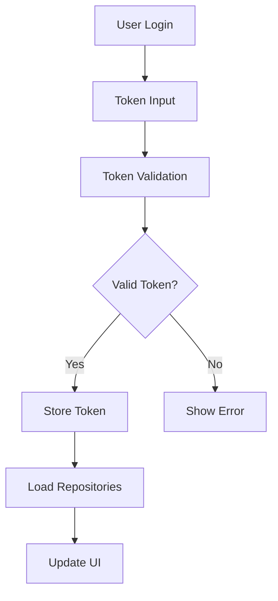
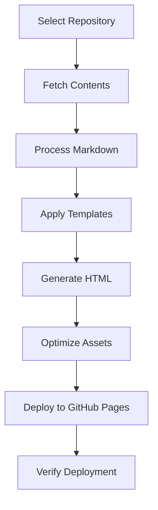
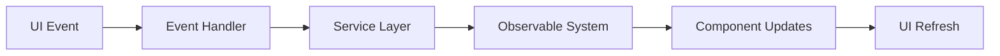

# 🏗️ MDSG Architecture Guide

> Understanding MDSG's technical design, principles, and architectural
> decisions.

## 🎯 Architecture Overview

MDSG (Markdown Static Generator) is a **client-side static site generator**
built with modern web technologies. It follows **KISS, SOLID, DRY, and CLEAN**
principles to maintain simplicity, modularity, and maintainability.

### 🏛️ Core Principles

#### 1. **Client-Side First**

- **No server required** - Runs entirely in the browser
- **GitHub API powered** - Direct integration with repositories
- **Static deployment** - Host anywhere (GitHub Pages, Netlify, Vercel)

#### 2. **Security by Design**

- **XSS prevention** - All user input sanitized
- **Token isolation** - Secure credential management
- **CSP compliance** - Content Security Policy enforced
- **Minimal attack surface** - No server-side vulnerabilities

#### 3. **Performance Optimized**

- **Bundle ≤ 20KB** - Ultra-lightweight footprint
- **Lazy loading** - Components loaded on demand
- **Efficient rendering** - Minimal DOM manipulation
- **Memory conscious** - Proper cleanup and garbage collection

#### 4. **Developer Experience**

- **ES6 modules** - Modern JavaScript architecture
- **Service pattern** - Clear separation of concerns
- **Event-driven** - Reactive programming model
- **Test coverage** - 191 comprehensive tests

## 📁 Project Structure

```
mdsg/
├── 📁 src/                    # Source code
│   ├── main.js                # 🎯 Core MDSG class & initialization
│   ├── 📁 services/           # 🔧 Business logic layer
│   │   ├── auth.js            # 🔐 Authentication service
│   │   ├── github.js          # 📡 GitHub API integration
│   │   └── deployment.js      # 🚀 Site deployment logic
│   ├── 📁 events/             # ⚡ Event system
│   │   ├── observable.js      # 📡 Observable pattern implementation
│   │   └── handlers.js        # 🎮 UI event handlers
│   ├── 📁 utils/              # 🛠️ Utilities
│   │   ├── security-minimal.js # 🔒 Security functions
│   │   ├── markdown-processor.js # 📝 Markdown parsing
│   │   └── state-management.js # 📊 State management
│   └── 📁 components/         # 🎨 UI components
│       └── ui-components.js   # 🖼️ Reusable UI elements
├── 📁 tests/                  # 🧪 Test suite
├── 📁 docs/                   # 📚 Documentation
└── 📁 public/                 # 📦 Static assets
```

## 🧩 Core Components

### 1. **MDSG Core Class** (`src/main.js`)

The heart of the application - orchestrates all other components.

```javascript
class MDSG {
  constructor() {
    this.services = new ServiceRegistry();
    this.eventSystem = new ObservableEventSystem();
    this.uiComponents = new UIComponents();
    this.initialize();
  }

  // Lifecycle management
  initialize() {
    /* ... */
  }
  setupEventHandlers() {
    /* ... */
  }
  handleAuthentication() {
    /* ... */
  }
}
```

**Responsibilities:**

- Application lifecycle management
- Service coordination
- Event system initialization
- Authentication flow orchestration

**Key Features:**

- **Singleton pattern** - Single application instance
- **Dependency injection** - Services injected at runtime
- **Event coordination** - Central event hub
- **Error handling** - Global error boundary

### 2. **Service Layer** (`src/services/`)

Business logic encapsulated in focused service classes.

#### Authentication Service (`auth.js`)

```javascript
class AuthenticationService {
  async authenticateWithGitHub(token) {
    // Token validation and user authentication
  }

  async refreshAuthentication() {
    // Handle token refresh and validation
  }
}
```

**Responsibilities:**

- GitHub OAuth flow
- Token management and validation
- User session handling
- Authentication state management

#### GitHub API Service (`github.js`)

```javascript
class GitHubAPIService {
  async getRepositories() {
    // Fetch user repositories
  }

  async getRepositoryContents(repo, path) {
    // Fetch repository file contents
  }

  async createFile(repo, path, content) {
    // Create or update repository files
  }
}
```

**Responsibilities:**

- GitHub API communication
- Repository management
- File operations (create, read, update, delete)
- API rate limiting and error handling

#### Deployment Service (`deployment.js`)

```javascript
class DeploymentService {
  async deployToGitHubPages(repo, content) {
    // Deploy static site to GitHub Pages
  }

  async validateDeployment(url) {
    // Verify successful deployment
  }
}
```

**Responsibilities:**

- Static site generation
- GitHub Pages deployment
- Deployment validation
- Asset optimization

### 3. **Event System** (`src/events/`)

Reactive event-driven architecture for component communication.

#### Observable Pattern (`observable.js`)

```javascript
class ObservableEventSystem {
  subscribe(event, callback) {
    // Subscribe to events
  }

  emit(event, data) {
    // Emit events to subscribers
  }

  unsubscribe(event, callback) {
    // Clean up subscriptions
  }
}
```

**Key Events:**

- `auth:login` - User authentication success
- `auth:logout` - User logout
- `repo:selected` - Repository selection
- `site:generated` - Site generation complete
- `deploy:success` - Deployment success
- `error:occurred` - Error handling

#### Event Handlers (`handlers.js`)

```javascript
class EventHandlerService {
  setupUIEventHandlers() {
    // DOM event binding
  }

  handleAuthenticationEvents() {
    // Authentication flow events
  }

  handleDeploymentEvents() {
    // Deployment process events
  }
}
```

### 4. **Security Layer** (`src/utils/security-minimal.js`)

Comprehensive security utilities for XSS prevention and input validation.

```javascript
class MinimalSecurity {
  static sanitizeHTML(html) {
    // Remove dangerous HTML elements and attributes
  }

  static escapeText(text) {
    // Escape special characters for safe display
  }

  static validateToken(token) {
    // Validate GitHub token format and permissions
  }

  static isValidURL(url) {
    // Validate URL format and security
  }
}
```

**Security Features:**

- **XSS Prevention** - HTML sanitization
- **Input Validation** - Type and format checking
- **Token Security** - Secure credential handling
- **URL Validation** - Prevent malicious redirects

## 🔄 Data Flow Architecture

### 1. **Authentication Flow**



### 2. **Site Generation Flow**



### 3. **Event System Flow**



## 🎨 Design Patterns

### 1. **Service Registry Pattern**

Centralized service management and dependency injection.

```javascript
class ServiceRegistry {
  constructor() {
    this.services = new Map();
    this.initializeServices();
  }

  register(name, service) {
    this.services.set(name, service);
  }

  get(name) {
    return this.services.get(name);
  }
}
```

**Benefits:**

- **Loose coupling** - Components don't depend on concrete classes
- **Testability** - Easy to mock services for testing
- **Flexibility** - Services can be swapped at runtime

### 2. **Observer Pattern**

Event-driven communication between components.

```javascript
// Publisher
this.eventSystem.emit('repo:selected', { repo: selectedRepo });

// Subscriber
this.eventSystem.subscribe('repo:selected', data => {
  this.loadRepositoryContents(data.repo);
});
```

**Benefits:**

- **Decoupling** - Components don't need direct references
- **Scalability** - Easy to add new event listeners
- **Maintainability** - Clear event contracts

### 3. **Module Pattern**

ES6 modules for clean separation and encapsulation.

```javascript
// Export specific functions
export { AuthenticationService, TokenValidator };

// Import only what's needed
import { AuthenticationService } from './services/auth.js';
```

**Benefits:**

- **Tree shaking** - Unused code eliminated
- **Namespace isolation** - No global pollution
- **Explicit dependencies** - Clear import/export contracts

### 4. **Singleton Pattern**

Single instance for core services.

```javascript
class MDSG {
  constructor() {
    if (MDSG.instance) {
      return MDSG.instance;
    }
    MDSG.instance = this;
    this.initialize();
  }
}
```

**Benefits:**

- **Resource efficiency** - Single service instances
- **State consistency** - Shared state across application
- **Control** - Managed service lifecycle

## 🔧 Technical Decisions

### 1. **Why Client-Side Only?**

**Decision:** Build MDSG as a pure client-side application.

**Rationale:**

- ✅ **No server costs** - Free to host and run
- ✅ **Security isolation** - No server vulnerabilities
- ✅ **Scalability** - CDN-distributed, globally fast
- ✅ **Simplicity** - Single deployment target
- ❌ **SEO limitations** - Client-rendered content
- ❌ **JavaScript dependency** - Requires JS enabled

**Implementation:**

- GitHub API for data storage
- Local storage for user preferences
- GitHub Pages for hosting generated sites

### 2. **Why ES6 Modules?**

**Decision:** Use native ES6 modules instead of bundlers like Webpack.

**Rationale:**

- ✅ **Native browser support** - No build step required
- ✅ **Better debugging** - Original source files in browser
- ✅ **Faster development** - No compilation delays
- ✅ **Tree shaking** - Unused code eliminated
- ❌ **HTTP/2 dependency** - Multiple file requests
- ❌ **Legacy browser support** - IE11 not supported

**Implementation:**

```javascript
// Dynamic imports for code splitting
const service = await import('./services/deployment.js');

// Static imports for dependencies
import { MinimalSecurity } from './utils/security-minimal.js';
```

### 3. **Why Observable Pattern?**

**Decision:** Implement custom observable system instead of using libraries.

**Rationale:**

- ✅ **Bundle size** - No external dependencies
- ✅ **Customization** - Tailored to MDSG needs
- ✅ **Performance** - Optimized for specific use cases
- ✅ **Learning** - Team understanding of implementation
- ❌ **Development time** - Custom implementation required
- ❌ **Battle testing** - Less proven than mature libraries

**Implementation:**

```javascript
class ObservableEventSystem {
  constructor() {
    this.events = new Map();
  }

  subscribe(event, callback) {
    if (!this.events.has(event)) {
      this.events.set(event, new Set());
    }
    this.events.get(event).add(callback);
  }
}
```

### 4. **Why Minimal Security Class?**

**Decision:** Build custom security utilities instead of using libraries.

**Rationale:**

- ✅ **Bundle optimization** - Only needed functions included
- ✅ **Security focus** - XSS prevention prioritized
- ✅ **Control** - Complete understanding of implementation
- ✅ **Performance** - Optimized for MDSG use cases
- ❌ **Security expertise** - Requires careful implementation
- ❌ **Maintenance burden** - Custom security code responsibility

**Implementation:**

```javascript
static sanitizeHTML(html) {
  const div = document.createElement('div');
  div.innerHTML = html;

  // Remove dangerous elements
  const dangerousTags = ['script', 'iframe', 'object', 'embed'];
  dangerousTags.forEach(tag => {
    const elements = div.getElementsByTagName(tag);
    for (let i = elements.length - 1; i >= 0; i--) {
      elements[i].remove();
    }
  });

  return div.innerHTML;
}
```

## 🚀 Performance Strategies

### 1. **Bundle Size Optimization**

**Target:** ≤ 20KB gzipped

**Strategies:**

- **Tree shaking** - ES6 modules eliminate unused code
- **Minimal dependencies** - Custom implementations preferred
- **Code splitting** - Dynamic imports for large features
- **Compression** - Gzip and Brotli compression

**Monitoring:**

```bash
# Check bundle size
npm run build
npx bundlesize

# Analyze bundle composition
npx bundle-analyzer
```

### 2. **Memory Management**

**Strategies:**

- **Event cleanup** - Unsubscribe from events on component destroy
- **DOM references** - Avoid storing DOM element references
- **Service lifecycle** - Proper service initialization and cleanup
- **Garbage collection** - Null references when done

**Implementation:**

```javascript
destroy() {
  // Clean up event subscriptions
  this.eventSystem.unsubscribe('auth:login', this.handleLogin);

  // Clear DOM references
  this.elements = null;

  // Clean up services
  this.services.clear();
}
```

### 3. **Lazy Loading**

**Strategies:**

- **Dynamic imports** - Load modules on demand
- **Route-based splitting** - Split code by application routes
- **Feature flags** - Load features when needed
- **Asset optimization** - Load images and assets progressively

**Implementation:**

```javascript
async loadDeploymentService() {
  if (!this.deploymentService) {
    const module = await import('./services/deployment.js');
    this.deploymentService = new module.DeploymentService();
  }
  return this.deploymentService;
}
```

## 🧪 Testing Strategy

### 1. **Test Categories**

#### Unit Tests

- **Service logic** - Business logic isolation
- **Utility functions** - Pure function testing
- **Security functions** - XSS prevention validation
- **Event system** - Observable pattern testing

#### Integration Tests

- **Service coordination** - Multi-service workflows
- **API integration** - GitHub API interaction
- **Authentication flow** - End-to-end auth testing
- **Deployment process** - Site generation and deployment

#### Security Tests

- **XSS prevention** - Malicious input handling
- **Token validation** - Authentication security
- **Input sanitization** - User input processing
- **URL validation** - Redirect attack prevention

### 2. **Test Structure**

```javascript
describe('MinimalSecurity', () => {
  describe('sanitizeHTML', () => {
    it('should remove script tags', () => {
      const input = '<p>Hello</p><script>alert("xss")</script>';
      const result = MinimalSecurity.sanitizeHTML(input);
      expect(result).not.toContain('<script>');
      expect(result).toContain('<p>Hello</p>');
    });
  });
});
```

### 3. **Test Coverage Goals**

- **Unit tests:** 90%+ coverage
- **Critical paths:** 100% coverage (auth, security, deployment)
- **Edge cases:** Comprehensive error condition testing
- **Performance:** Bundle size and memory usage validation

## 🔮 Future Architecture Considerations

### 1. **Scalability Planning**

#### Plugin System

```javascript
class PluginManager {
  async loadPlugin(name) {
    const plugin = await import(`./plugins/${name}.js`);
    return plugin.initialize(this.services);
  }
}
```

#### Micro-Frontend Architecture

- **Independent deployment** - Deploy features separately
- **Team autonomy** - Teams own specific features
- **Technology flexibility** - Different frameworks per feature

### 2. **Performance Enhancements**

#### Service Workers

- **Offline support** - Cache critical resources
- **Background sync** - Queue API calls when offline
- **Push notifications** - Deploy notifications

#### WebAssembly Integration

- **Markdown processing** - Faster parsing with WASM
- **Cryptographic operations** - Secure computations
- **Image processing** - Client-side image optimization

### 3. **Developer Experience**

#### TypeScript Migration

```typescript
interface AuthenticationService {
  authenticateWithGitHub(token: string): Promise<User>;
  refreshAuthentication(): Promise<void>;
}
```

#### Better Tooling

- **Hot module replacement** - Faster development
- **Source maps** - Better debugging
- **Automated testing** - CI/CD integration

## 📚 Architecture Resources

### Reference Materials

- [SOLID Principles Guide](https://blog.cleancoder.com/uncle-bob/2020/10/18/Solid-Relevance.html)
- [Observable Pattern](https://refactoring.guru/design-patterns/observer)
- [ES6 Modules Guide](https://developer.mozilla.org/en-US/docs/Web/JavaScript/Guide/Modules)
- [Security Best Practices](https://owasp.org/www-project-top-ten/)

### MDSG Documentation

- [API Reference](api-reference.md) - Complete JavaScript API
- [Contributing Guide](contributing.md) - Development guidelines
- [Security Guide](../operations/security.md) - Security practices
- [Setup Guide](../../SETUP_GUIDE.md) - Development environment

## 🎯 Architecture Evolution

MDSG's architecture has evolved through several phases:

1. **Phase 1:** Monolithic client-side application
2. **Phase 2:** Service-oriented architecture with event system
3. **Phase 3:** Security-hardened with comprehensive testing
4. **Phase 4:** Performance-optimized with bundle management
5. **Phase 5:** Documentation-complete with developer experience

**Next Phase:** Plugin system, TypeScript migration, and enhanced developer
tooling.

---

**🏗️ Architecture Motto:** _"Simple by design, robust by practice, maintainable
by principle."_

This architecture ensures MDSG remains lightweight, secure, and maintainable
while providing powerful static site generation capabilities.
