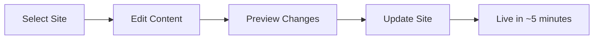

# 🛠️ MDSG Site Management Guide

> Learn how to manage multiple sites, edit existing content, and organize your
> MDSG projects

## 🎯 Site Management Overview

MDSG makes it easy to:

- ✅ Create multiple sites for different projects
- ✅ Edit and update existing sites
- ✅ Organize your content effectively
- ✅ Track your published sites

## 📋 Your Sites Dashboard

### Accessing Your Sites

1. Sign in to MDSG
2. Your existing sites appear in the sidebar
3. Click any site to edit it
4. Use the "Create New Site" button for additional sites

### Site Information

Each site shows:

- 📝 **Site title** (extracted from your markdown)
- 🔗 **Live URL** (your GitHub Pages link)
- 📅 **Last updated** (when you last edited)
- 📊 **Content size** (word count and file size)

## ✏️ Editing Existing Sites

### Quick Edit

1. Click on any site in your dashboard
2. MDSG loads the content in the editor
3. Make your changes
4. Click "Update Site" to deploy changes

### What Gets Updated

- ✅ **Content** - Your markdown text
- ✅ **Site title** - Extracted from H1 headers
- ✅ **Live site** - Automatically redeployed
- ✅ **GitHub repo** - Source files updated

### Editing Workflow



## 🗂️ Organizing Multiple Sites

### Site Naming Strategy

MDSG automatically generates repo names, but you can organize by:

**By Project Type:**

- `portfolio-site` - Personal portfolio
- `blog-tech` - Technical blog
- `docs-project` - Project documentation

**By Client/Company:**

- `client-acme-landing` - Client work
- `company-handbook` - Internal docs

**By Topic:**

- `tutorials-javascript` - JS tutorials
- `recipes-family` - Family recipes

### Site Categories

Consider creating sites for:

**Personal Use:**

- 📝 Personal blog
- 💼 Professional portfolio
- 📚 Learning notes
- 🎨 Creative projects

**Business Use:**

- 📊 Project documentation
- 🏢 Company landing pages
- 📋 Team handbooks
- 🎯 Marketing sites

**Community Use:**

- 🤝 Open source project docs
- 📚 Tutorial collections
- 🎪 Event websites
- 📰 Newsletter archives

## 🔄 Content Workflow

### Draft → Review → Publish

1. **Draft**: Work on content in MDSG editor
2. **Review**: Use preview to check formatting
3. **Publish**: Deploy to GitHub Pages
4. **Iterate**: Edit and update as needed

### Version Control

Your sites are backed by Git:

- ✅ **Every update** creates a new commit
- ✅ **Change history** preserved in GitHub
- ✅ **Rollback capability** via GitHub interface
- ✅ **Collaboration** possible through GitHub

## 📱 Content Management Tips

### Writing Efficiently

- 📝 **Use templates** - Start with existing content
- 🔄 **Iterate quickly** - Small, frequent updates
- 📋 **Plan structure** - Outline before writing
- 🎯 **Focus content** - One topic per site

### Keeping Content Fresh

- 📅 **Regular updates** - Schedule content reviews
- 🔗 **Link maintenance** - Check for broken links
- 📊 **Analytics** - Monitor site performance
- 💬 **Feedback** - Gather user input

### Content Guidelines

```markdown
# Good Site Structure

- Clear, descriptive title
- Logical section headers
- Scannable paragraphs
- Relevant images/examples
- Call-to-action conclusions

# Avoid

- Too many topics in one site
- Extremely long pages
- Broken or dead links
- Outdated information
```

## 🔧 Advanced Management

### Site Settings

Each site can be configured for:

- **Visibility**: Public or private repos
- **Pages**: GitHub Pages enabled/disabled
- **Description**: Repository description
- **Topics**: GitHub repository topics

### Custom Domains

For professional sites:

1. Configure custom domain in GitHub Pages settings
2. Update DNS records with your provider
3. Enable HTTPS in GitHub Pages
4. Test domain propagation

### Collaboration

To collaborate on sites:

1. Share GitHub repository access
2. Contributors can edit via GitHub interface
3. Use MDSG for quick visual edits
4. Merge contributions via GitHub

## 📊 Site Analytics

### Built-in Metrics

MDSG provides:

- 📄 **Page count** - Number of pages/sections
- 📝 **Word count** - Content length
- 🔗 **Link count** - External references
- 📷 **Image count** - Media usage

### GitHub Insights

Your repository shows:

- 👥 **Visitors** - Site traffic
- 🔄 **Commits** - Update frequency
- 🌟 **Stars** - Community interest
- 🍴 **Forks** - Content reuse

### External Analytics

Consider adding:

- 📊 **Google Analytics** - Detailed visitor stats
- 🎯 **Plausible** - Privacy-focused analytics
- 📈 **GitHub Pages insights** - Basic traffic data

## 🗑️ Site Cleanup

### Archiving Old Sites

For sites you no longer need:

1. **Archive the repository** (preserves content)
2. **Disable GitHub Pages** (stops serving site)
3. **Update site description** (mark as archived)

### Deleting Sites

⚠️ **Permanent action** - Cannot be undone:

1. Go to GitHub repository settings
2. Scroll to "Danger Zone"
3. Click "Delete this repository"
4. Confirm deletion

## 🆘 Troubleshooting

### Site Not Updating

1. Check GitHub Pages status in repo settings
2. Verify GitHub Pages is enabled
3. Wait 5-10 minutes for deployment
4. Clear browser cache

### Content Not Saving

1. Check internet connection
2. Verify GitHub token hasn't expired
3. Try refreshing MDSG and re-editing
4. Check GitHub API rate limits

### Site Not Accessible

1. Verify GitHub Pages URL format
2. Check repository visibility settings
3. Ensure content exists in main branch
4. Test from different browser/device

## 🚀 Best Practices

### Naming Conventions

- Use descriptive, clear names
- Include version or date if relevant
- Avoid special characters
- Keep names concise but meaningful

### Content Organization

- One clear topic per site
- Logical heading hierarchy
- Consistent formatting style
- Regular content audits

### Maintenance Schedule

- **Weekly**: Review recent changes
- **Monthly**: Update outdated content
- **Quarterly**: Check all external links
- **Annually**: Archive unused sites

## 📚 Related Documentation

- 🚀 [Getting Started Guide](getting-started.md) - Create your first site
- 📝 [Markdown Guide](markdown-guide.md) - Writing effective content
- 🐞 [Troubleshooting](troubleshooting.md) - Solve common issues

**Manage your sites like a pro!** 🎯
